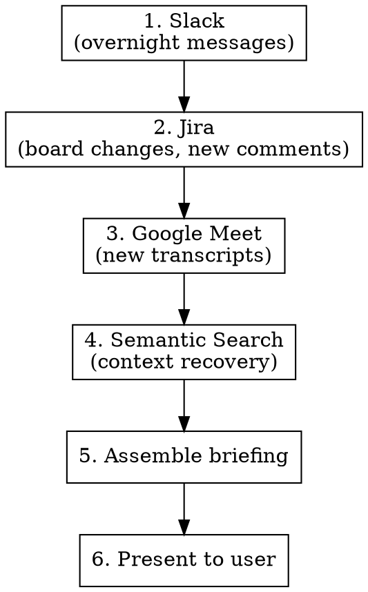

# Morning Paper

## Overview

A briefing that answers: what happened while you were away? Pulls from every source the user has — Slack, Jira, Google Meet transcripts, semantic search — and presents it as one readable summary. Like a newspaper: headlines first, details on demand.

The name is "morning paper" but the concept is edition-based — the time gap determines the depth:

| Edition | When | Depth |
|---------|------|-------|
| Morning paper | Start of work day | Overnight: Slack + Jira + Meet from yesterday |
| Afternoon paper | Back from meetings/lunch/life | Last few hours of Slack + Jira activity |
| Saturday paper | Monday morning / back from days off | Full multi-day digest, weighted by recency |

Same pipeline, different time window. Scale the query depth to the gap.

## When to Use

- Start of a work day or session (morning edition)
- Returning from meetings, lunch, errands (afternoon edition)
- Monday morning or back from vacation (saturday/weekend edition)
- User says "catch me up", "what did I miss", "where are we", "morning paper", "afternoon paper"
- After session-start completes (session-start handles git state; this handles everything else)

## When NOT to Use

- Mid-session context check (just read the relevant source directly)
- User only wants git state (that's session-start)

## The Pipeline



## Step Details

### 1. Slack — what happened in the channels

Read the team channel and any active DMs since last session.

```bash
# Team channel — last 25 messages
slackcli conversations read #team-channel --limit 25

# Self-DM — check for drafts or notes left for yourself
slackcli conversations read #self-dm --limit 10
```

**Extract:** New messages from team members, decisions made, requests directed at you, blockers raised, anything that needs a response.

### 2. Jira — what moved on the board

Check the active sprint and any tickets assigned to you or recently updated.

```bash
# Your assigned tickets — current state
jira list -p PROJ -a "Your Name" -S "In Progress" 2>/dev/null
jira list -p PROJ -a "Your Name" -S "To Do" 2>/dev/null
jira list -p PROJ -a "Your Name" -S "Test" 2>/dev/null
jira list -p PROJ -a "Your Name" -S "Review" 2>/dev/null
jira list -p PROJ -a "Your Name" -S "Stalled" 2>/dev/null
jira list -p PROJ -a "Your Name" -S "Done" 2>/dev/null

# Recently updated tickets in the project (last 24h)
# This catches ALL status changes including "Won't Do" (which go-jira can't query by name due to the apostrophe)
jira list -p PROJ -q "updated >= -1d ORDER BY updated DESC" 2>/dev/null
```

For each ticket that changed since last session, get the latest comment:

```bash
lede TICKET
```

**Extract:** Status changes, new comments, new tickets created, blockers, anything you need to respond to or act on.

### 3. Google Meet — what was said in meetings

Check for new transcripts since last session. The DAG fetches them automatically.

```bash
# Check for recent transcripts
ls -lt ~/data/google_meet/dam_effective_date=$(date +%Y%m%d)/ 2>/dev/null

# If today has no transcripts, check yesterday
ls -lt ~/data/google_meet/dam_effective_date=$(date -v-1d +%Y%m%d)/ 2>/dev/null
```

If new transcripts exist, rebuild the corpus and query for key topics:

```bash
# Rebuild if new transcripts
make -C ~/semantic-search build

# Query for active work items
make -C ~/semantic-search query Q="action items decisions requests" LIMIT=10
```

**Extract:** Decisions made, action items assigned to you, architectural directions, requests from teammates.

### 4. Semantic search — context recovery

Query your semantic search tool for context relevant to today's planned work. Use ticket summaries and recent Slack topics as search terms.

```bash
# Query for each active ticket
make -C ~/semantic-search query Q="<topic from active ticket>" LIMIT=5

# Query for any names/topics that came up in Slack
make -C ~/semantic-search query Q="<topic from slack>" LIMIT=5
```

**Extract:** Prior decisions, context that informs today's work, things said in meetings that didn't make it to tickets.

### 5. Assemble the briefing

Structure like a newspaper — headlines first, then sections, most important at top.

```
## Morning Briefing — YYYY-MM-DD

### Headlines
- [1-line summary of most important thing]
- [1-line summary of second most important]
- [1-line summary of third]

### Slack Overnight
[Who said what, what needs a response, any decisions made]

### Jira Board
| Ticket | Summary | Status | What changed |
|--------|---------|--------|-------------|
[table of tickets that moved]

### Meeting Notes
[Key points from any new transcripts — decisions, action items, direction changes]

### Today's Plate
1. [Highest priority — why]
2. [Second priority — why]
3. [Third priority — why]

### Needs Response
- [anything that's waiting on you — Slack message, Jira comment, etc.]
```

### 6. Present to user

Output the briefing directly in the conversation.

After presenting, ask two things:
1. "Want this in Marked 2?" — if yes, write the briefing to `/tmp/<edition>-briefing-YYYY-MM-DD.md` and `open -a "Marked 2" /tmp/<edition>-briefing-YYYY-MM-DD.md`. Edition is `morning`, `afternoon`, or `saturday`.
2. "Anything you want to dig into before we start?"

## Parallel Execution

Steps 1-3 are independent — run them in parallel using subagents or parallel tool calls when possible. Step 4 depends on what was found in 1-3 (search terms come from those results). Step 5 depends on all of 1-4.

## Red Flags

- Presenting raw Slack/Jira dumps instead of summarized briefing
- Missing a source (forgot to check Slack, skipped Meet transcripts)
- Not checking semantic search for context on active tickets
- Burying the most important item below less important ones
- Forgetting to include "Needs Response" items — these are time-sensitive
- Not rebuilding the search corpus when new transcripts exist
- Presenting the briefing as a wall of text instead of scannable sections
